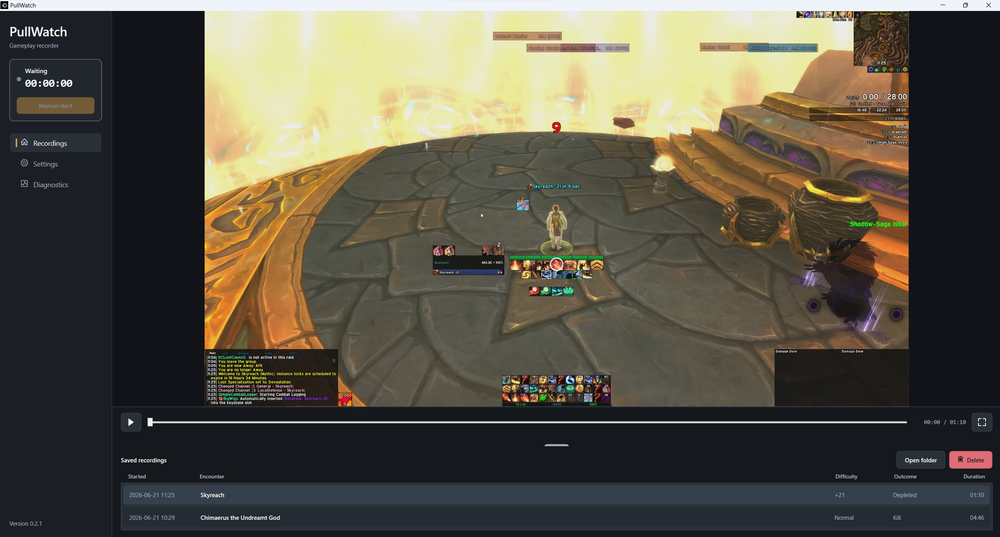

# PullWatch

[](https://github.com/afotescu/PullWatch/actions/workflows/ci.yml)
[](https://github.com/afotescu/PullWatch/releases/latest)
[](LICENSE)


PullWatch is a lightweight Windows desktop app for recording World of Warcraft
gameplay. It watches the WoW process and combat log, starts recordings for
Mythic+ runs and raid encounters, and keeps finished videos in a browsable
in-app library.

## Screenshot



## Status

This project is in early development. Expect issues.

The current release focuses on World of Warcraft Retail. Automatic logs folder
detection looks for Retail `_retail_\Logs` directories. Classic, PTR, and other
variants may work only with manual folder configuration and are not the primary
target yet.

## Download

Download the latest Windows x64 installer from the
[GitHub Releases page](https://github.com/afotescu/PullWatch/releases/latest).

Release builds are currently unsigned, so Windows SmartScreen may show a warning
for new downloads.

Closing the PullWatch window keeps the app running in the system tray. Use
`Exit` from the tray icon menu to fully quit PullWatch.

## Features

- Automatic recording for Mythic+ runs from `CHALLENGE_MODE_START` and
  `CHALLENGE_MODE_END` combat-log events.
- Automatic recording for raid encounters from `ENCOUNTER_START` and
  `ENCOUNTER_END` combat-log events.
- Manual start and stop when the World of Warcraft window is available.
- In-app playback with seeking, time display, and fullscreen viewing.
- Saved recordings table with start time, dungeon or encounter, key level or
  raid difficulty, outcome, and duration.
- Recording management actions for opening the recordings folder and deleting a
  selected finished recording.
- Settings for combat-log and recordings directories, Mythic+ and raid toggles,
  quality preset, frame rate, system audio, microphone, cursor capture, and
  capture border.
- Diagnostics view with combat-log, WoW process, recorder state, effective
  settings, and recent application logs.

## Requirements

- Windows x64

Release installers are self-contained and do not require a separately installed
.NET runtime.

Automatic recording requires World of Warcraft combat logging to be enabled so
the game writes `WoWCombatLog*.txt` files.

## Data Locations

Recordings are saved by default to:

```text
Videos\PullWatch
```

You can change this in Settings.

PullWatch stores its settings and recording catalog under:

```text
%LOCALAPPDATA%\PullWatch
```

The catalog database is `pullwatch.db`; it stores metadata for finished
recordings, not the video files themselves.

## Privacy

PullWatch does not contain app telemetry or upload recordings, settings, combat
logs, or diagnostics. Recording files, settings, and the recording catalog stay
on your machine unless you share them yourself.

Diagnostics can include local file paths, WoW window details, recent application
log messages, and selected settings. Review copied or exported diagnostics
before posting them publicly.

## Recording Behavior

PullWatch captures the World of Warcraft window with calibrated H.264 or H.265
video encoding. It uses simple quality presets instead of exposing raw bitrate
controls:

- `Compact` for smaller files
- `Balanced` for the default quality and size tradeoff
- `High` for cleaner motion and larger files

Frame rate is selectable as `30 FPS` or `60 FPS`. The settings screen shows an
approximate recording size per minute based on the primary display; actual
recordings use the captured WoW window size.

The following estimates assume `60 FPS`, system audio enabled at `96 kbps`, and
a five-minute recording. FFmpeg uses the target bitrate shown here, plus a
`1.5x` max rate and `2x` buffer size. Lower frame rates use proportionally less
video bitrate.

### Compact

| Resolution | H.264 target | H.264 size | H.265 target | H.265 size |
| --- | ---: | ---: | ---: | ---: |
| 4K / 3840x2160 | 24 Mbps | ~904 MB | 16 Mbps | ~604 MB |
| 2K / 2560x1440 | 10 Mbps | ~379 MB | 7 Mbps | ~266 MB |
| 1K / 1920x1080 | 6 Mbps | ~229 MB | 4 Mbps | ~154 MB |
| 720p / 1280x720 | 4 Mbps | ~154 MB | 4 Mbps | ~154 MB |

### Balanced

| Resolution | H.264 target | H.264 size | H.265 target | H.265 size |
| --- | ---: | ---: | ---: | ---: |
| 4K / 3840x2160 | 35 Mbps | ~1,316 MB | 20 Mbps | ~754 MB |
| 2K / 2560x1440 | 16 Mbps | ~604 MB | 9 Mbps | ~341 MB |
| 1K / 1920x1080 | 9 Mbps | ~341 MB | 5 Mbps | ~191 MB |
| 720p / 1280x720 | 4 Mbps | ~154 MB | 4 Mbps | ~154 MB |

### High

| Resolution | H.264 target | H.264 size | H.265 target | H.265 size |
| --- | ---: | ---: | ---: | ---: |
| 4K / 3840x2160 | 50 Mbps | ~1,879 MB | 30 Mbps | ~1,129 MB |
| 2K / 2560x1440 | 22 Mbps | ~829 MB | 14 Mbps | ~529 MB |
| 1K / 1920x1080 | 12 Mbps | ~454 MB | 8 Mbps | ~304 MB |
| 720p / 1280x720 | 5 Mbps | ~191 MB | 4 Mbps | ~154 MB |

Automatic recording starts only when PullWatch can see the WoW window and read
the configured logs directory. If combat-log monitoring is unavailable, manual
recording can still be used while the WoW window is available.

Automatic recording is not retroactive. Start PullWatch before the Mythic+ key
or raid pull so it can see the combat-log start event.

Finished recordings are saved as `.mp4` files. File names include the recording
start time and context, such as `manual`, `mythic-plus`, or `raid`.

## Source

Source is available for transparency. Building locally requires:

- Windows x64
- .NET 10 SDK

Run the test suite:

```powershell
dotnet test PullWatch.sln -c Release -p:Platform=x64
```

Create a local self-contained Windows x64 publish build:

```powershell
./scripts/publish-win-x64.ps1
```

Publish builds include Gyan FFmpeg release essentials under the `ffmpeg` folder
and the LibVLC runtime under the `libvlc` folder next to `PullWatch.exe`.
PullWatch uses the bundled `ffmpeg.exe` before falling back to a machine-level
FFmpeg install.

## Key Dependencies

- [FFmpeg](https://ffmpeg.org/) via [Gyan FFmpeg builds](https://www.gyan.dev/ffmpeg/builds/)
- [LibVLCSharp](https://code.videolan.org/videolan/LibVLCSharp) and [LibVLC](https://www.videolan.org/vlc/libvlc.html)
- [Dapper](https://github.com/DapperLib/Dapper)
- [FluentMigrator](https://fluentmigrator.github.io/)

## Disclaimer

PullWatch is an independent project and is not affiliated with or endorsed by
Blizzard Entertainment.
