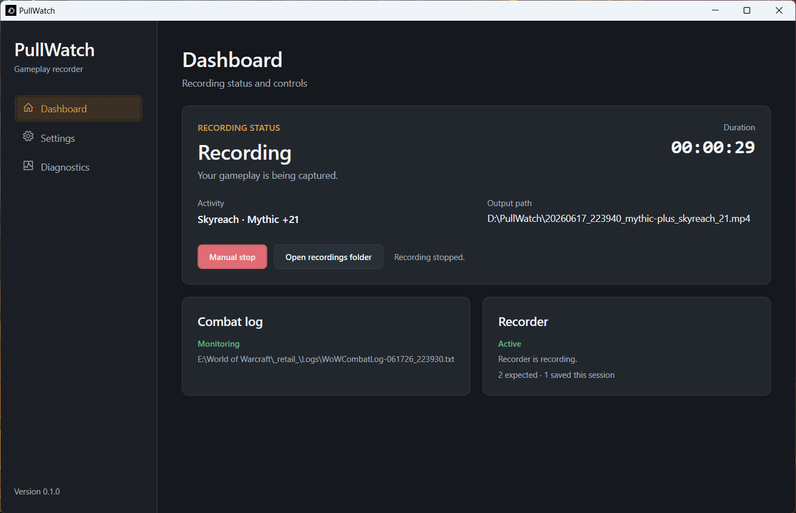

# PullWatch

A lightweight Windows desktop app that automatically records World of Warcraft
Mythic+ runs and raid encounters from combat-log events.

## Screenshot



## Status

This project is in early development. Expect issues.

Recordings are saved by default to:

```text
Videos/PullWatch
```

You can change this at any time in settings.

## Requirements

- Windows x64
- Windows Media Foundation
- Microsoft Visual C++ Redistributable 2015-2022 x64

Portable releases are self-contained and do not require a separately installed
.NET runtime.

If recording cannot start because the Visual C++ Redistributable is missing,
install the official Microsoft x64 redistributable:

```text
https://aka.ms/vc14/vc_redist.x64.exe
```

### Building from Source

- Windows x64
- .NET 10 SDK

## Key Dependencies

- [ScreenRecorderLib](https://github.com/sskodje/ScreenRecorderLib)

## How It Works

PullWatch currently handles these combat-log events:

- `CHALLENGE_MODE_START`
- `CHALLENGE_MODE_END`
- `ENCOUNTER_START`
- `ENCOUNTER_END`

PullWatch uses combat-log events to decide when recordings should start and
stop.

## Development

GitHub Actions runs build and tests on pushes and pull requests.

Run a Release build:

```powershell
dotnet run --project PullWatch.App/PullWatch.App.csproj -c Release -p:Platform=x64
```

Run tests:

```powershell
dotnet test PullWatch.sln -p:Platform=x64
```

Create a local self-contained Windows x64 publish:

```powershell
./scripts/publish-win-x64.ps1
```

The publish output is written to:

```text
artifacts/publish/win-x64
```

Most dependencies are bundled into `PullWatch.exe`. `ScreenRecorderLib.dll` is
kept next to the executable because the native recorder library does not load
reliably when embedded into the single-file bundle.

Create a GitHub release by pushing a version tag:

```powershell
git tag v0.1.0
git push origin v0.1.0
```

Release tags publish a Windows x64 zip and embed the tag version into the app.

## Disclaimer

PullWatch is an independent project and is not affiliated with or endorsed by
Blizzard Entertainment.
